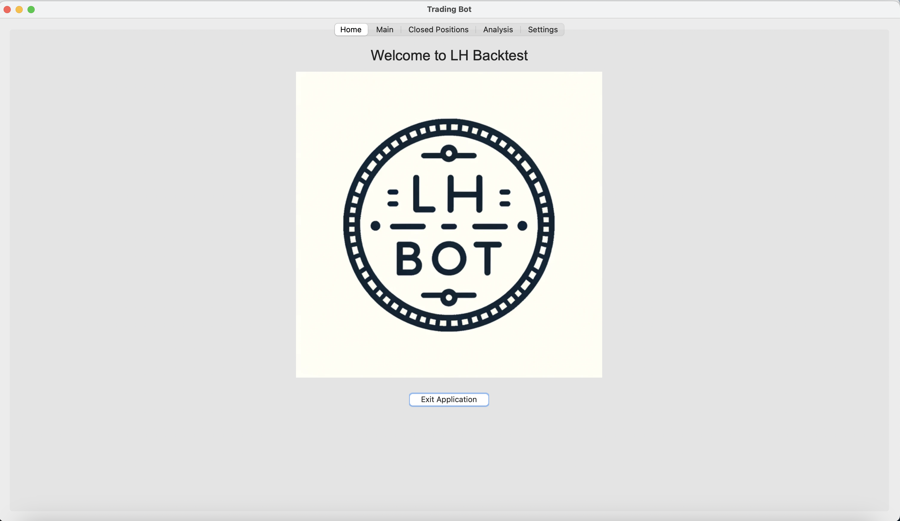
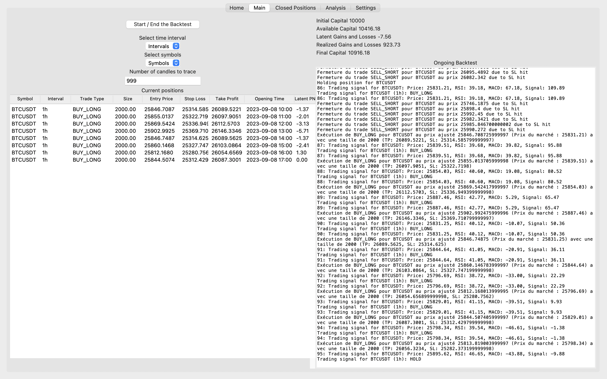
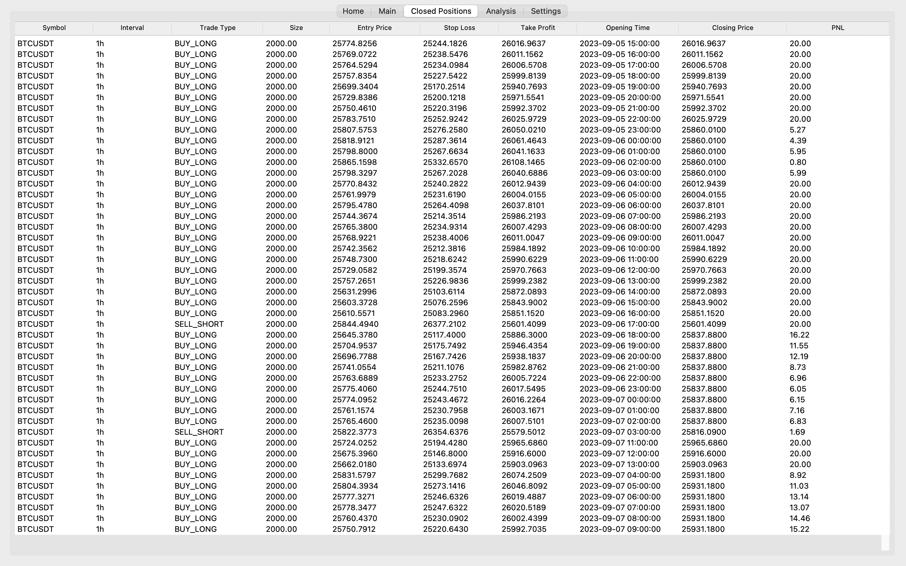
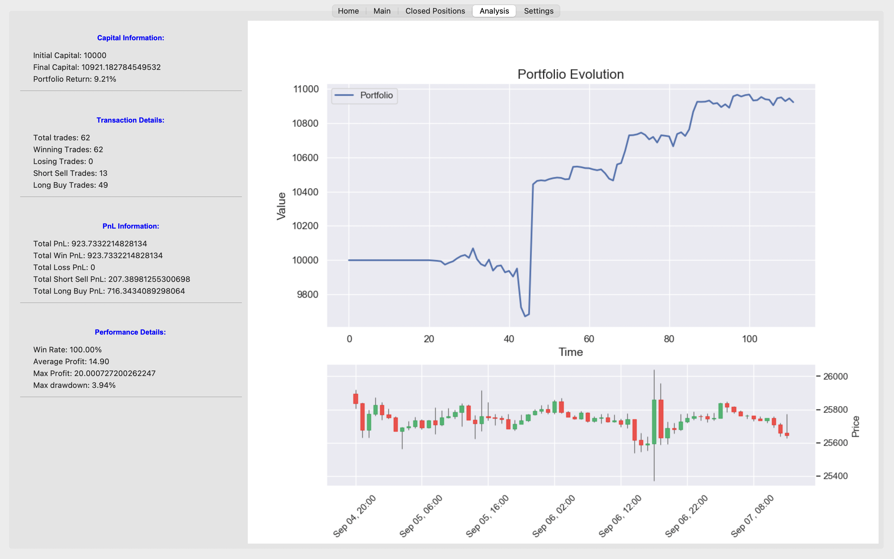
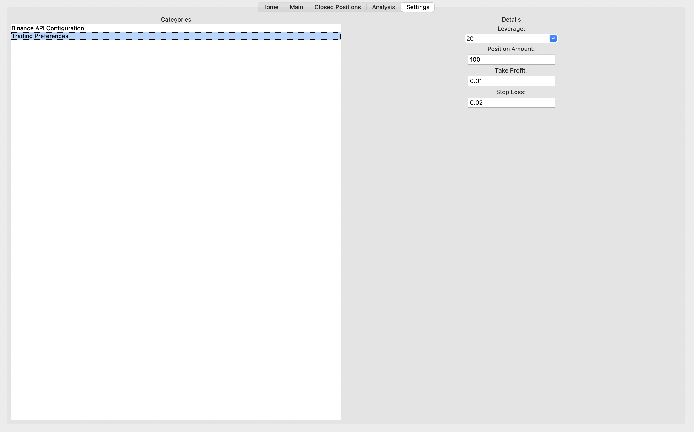

Backtest Trading App

Welcome to the Backtest Trading App! This tool allows users to backtest a pre-made trading strategies over historical data to see how they might have performed.

Personal Journey & Vision for AI: 

This project marks my first foray into the world of programming. While it has been an enlightening journey, I'd like to acknowledge the assistance of ChatGPT in co-writing and refining the code. Their insights and guidance have been invaluable in bringing this project to life. I firmly believe in the transformative potential of AI as personal assistants. The collaboration with ChatGPT has only strengthened that belief, showcasing how limitless the possibilities truly are. As technology continues to evolve, I envision a future where AI seamlessly integrates into our daily lives, amplifying our capabilities and fostering innovation.

Disclaimer

Entertainment Purposes Only:
This app is meant for entertainment purposes only and not as a tool for trading real-world assets. The outcomes and results provided by this application should not be interpreted as financial advice or guidance.

No Financial Advice: 
The information and results presented by this application do not constitute financial advice. Users are advised to conduct their own research or consult with a professional before making any financial decisions.

Strategy Code Partially Hidden:
The trading strategy implemented in this app is based on a combination of technical indicators such as RSI, MACD, Bollinger Band, and MA. However, please note that the core logic and detailed aspects of the trading strategies have been intentionally obfuscated or removed to protect proprietary rights. This decision ensures that specific trading logic and algorithms remain confidential.

Features

Backtesting Capabilities:
Test the trading strategies over historical data to see potential performance.
Crypto Currency Support: See how the pre-made strategy performs on selected cryptocurrencies with a selected amount of candles (max 999).

Interactive UI:
A user-friendly interface that allows for easy navigation and operation.

Extensive Data Libraries:
Access to a vast collection of historical data for various assets.

Performance Metrics:
Get detailed insights into how the strategy might have performed with metrics like returns, drawdown, and hit ratio

AI Trading Bot Project:
I'm currently working on implementing an AI-driven trading bot which will use machine learning techniques to predict market movements and execute trades. Stay tuned for updates on this exciting feature!

Contributing

While the core trading strategy remains confidential, contributions to other parts of the app are welcome. Please ensure to read the CONTRIBUTING.md guide for more details.

License

This project is licensed under the MIT License. See LICENSE.md for more details.

Your Sincerly, 

Loïc Hänggeli

Here are fews examples of the Interface : 

